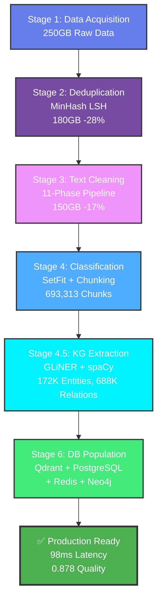

# 04 Pipeline

```mermaid
flowchart TD
    S1[Stage 1: Data Acquisition<br/>250GB Raw Data] --> S2[Stage 2: Deduplication<br/>MinHash LSH<br/>180GB -28%]
    S2 --> S3[Stage 3: Text Cleaning<br/>11-Phase Pipeline<br/>150GB -17%]
    S3 --> S4[Stage 4: Classification<br/>SetFit + Chunking<br/>693,313 Chunks]
    S4 --> S45[Stage 4.5: KG Extraction<br/>GLiNER + spaCy<br/>172K Entities, 688K Relations]
    S45 --> S6[Stage 6: DB Population<br/>Qdrant + PostgreSQL<br/>+ Redis + Neo4j]
    
    S6 --> READY[✅ Production Ready<br/>98ms Latency<br/>0.878 Quality]
    
    style S1 fill:#667eea,stroke:#333,stroke-width:2px,color:#fff
    style S2 fill:#764ba2,stroke:#333,stroke-width:2px,color:#fff
    style S3 fill:#F093FB,stroke:#333,stroke-width:2px,color:#fff
    style S4 fill:#4FACFE,stroke:#333,stroke-width:2px,color:#fff
    style S45 fill:#00F2FE,stroke:#333,stroke-width:2px,color:#fff
    style S6 fill:#43E97B,stroke:#333,stroke-width:2px,color:#fff
    style READY fill:#4CAF50,stroke:#333,stroke-width:3px,color:#fff
```

---

**Note:** This diagram is rendered automatically by GitHub markdown.
To export as image, use [Mermaid Live Editor](https://mermaid.live)
