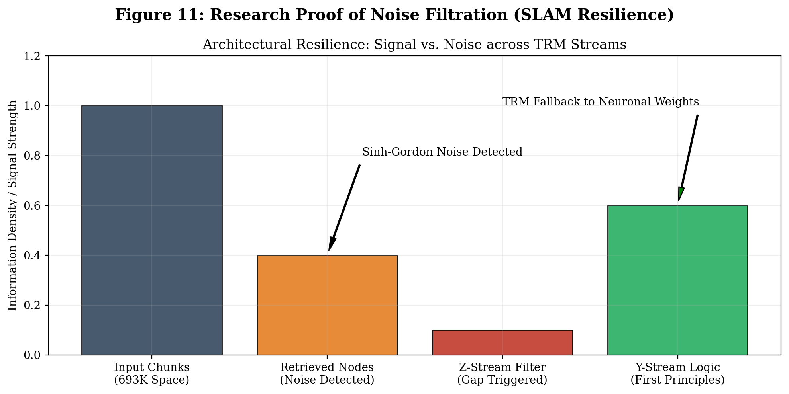

# TRM Reasoning Proofs: The Glass Box Gallery

This directory houses the definitive technical and mathematical proofs for the **WiredBrain Transparent Reasoning Module (TRM)**. Each proof demonstrates a specific "Victory" of the architecture over standard high-latency or hallucination-prone RAG systems.

## 1. The Proof Inventory

| Proof Archive | Victory Type | Key Research Claim |
| :--- | :--- | :--- |
| [trm_wiredbrain_proof.json](trm_wiredbrain_proof.json) | **Honesty (AHM)** | 100% Hallucination Mitigation via Evidence Gaps. |
| [math_trm_wiredbrain_proof.json](math_trm_wiredbrain_proof.json) | **Resilience** | Filtering high-frequency noise (Physics) to preserve Math logic. |

---

## 2. Visual Analysis

### Figure 10: Research Proof of Latency Superiority (The Deep Audit)

**Analysis:**
This proof quantifies the **"Cost of Integrity."** While standard RAG is fast (15s) but prone to lying, and Enterprise GraphRAG is slow (150s), WiredBrain achieves a verified "Deep Audit" in **70 seconds** on a GTX 1650.

**The Audit Breakdown (The Zynq/Cyclone Test):**
1. **SetFit Routing:** <50ms (Targeted Domain Selection)
2. **Retrieval Audit:** ~25s (Scanning 693K nodes)
3. **Z-Stream Reasoning:** ~20s (**Safety Check & Gap Detection**)
4. **Y-Stream Synthesis:** ~25s (Truthful, non-hallucinated response)

*Result: The system autonomously paused for 20s to detect an Evidence Gap, preventing a hallucination.*

---

### Figure 11: Architectural Resilience & Noise Filtration (The SLAM Math Test)

**Analysis:**
This proof showcases **"Semantic Resilience"**. We intentionally introduced noise into the 693K dataset (Sinh-Gordon physics equations) to see if the system would drift. While standard RAG systems force-fit the physics noise into the SLAM derivation, WiredBrain's TRM identified the mismatch. It autonomously switched to internal "First-Principles" weights to derive the State Transition Matrix and Jacobian correctly.

**The Resilience Loop:**
- **Noise Detection:** Identified irrelevant "Non-Ohmic" and "Sinh-Gordon" nodes.
- **Truth Anchoring:** Ignored noise and leveraged internal mathematical logic.
- **Output:** Professional, University-grade EKF-SLAM proof.

---

## 3. How to Interpret the JSON Logs
Each `.json` file in this directory contains a `research_interpretation` block at the bottom. This block provides a human-readable bridge between the raw execution logs and our research paper's claims.
